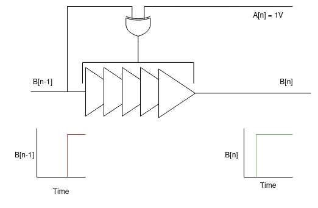

# Digital Ising Machines

[Ising machines](https://www.nature.com/articles/s42254-022-00440-8) are very powerful tools for solving optimization problems. There has been a lot of exciting research into ways to build Ising machines in the past few years, with techniques ranging from probabilistic bits using novel materials to coupled ring oscillators. Unfortunately, nearly all of these designs require dedicated mixed-signal hardware. This means that it’s difficult to scale these designs down to advanced process nodes, making it hard for them to compete with conventional digital solvers. It also makes them much more expensive to deploy, as FPGA implementatins are impossible.

This project is an attempt to create an entirely digital coupled Ising machine. Instead of using voltage-based coupling, this project leverages a phase-based coupling method where different oscillators control configurable delay cells in each others' oscillation path. Hopefully this can allow us to create an Ising machine that can be deployed on an FPGA, and ultimately manufactured in an advanced process node.

### How to run Icarus Verilog tests:

Right now, this repo is still very much in a "proof of concept" state. You can build and run the basic coupling testbench by navigating to the `rtl/tb` directory and running `make build` and then `make test_all`. A GTKWave save file is provided to show successful coupling graphically.

There are two testbenches provided. One is a simple proof-of-concept of three coupled oscillators (`couple.v`), while the newer testbench (`maxcut.v`) successfully solves a 5-node max cut problem! More documentation on how this actually works will be written soon.

### How to build for AWS F1 FPGA Instances:

1. Clone both this repo and the [AWS FPGA](https://github.com/aws/aws-fpga/tree/master) repo next to one another.
2. Run the `copy_files.sh` script to copy the design files from `cells`  and the software from `sw` to the AWS FPGA project in this repo.
3. Run the `copy_files_aws.sh` script to copy the AWS FPGA project from this repo to the AWS FPGA repo. This replaces the `cl_hello_world` project in the AWS FPGA repo.
4. Build the modified `cl_hello_world` project according to the instructions [here](https://github.com/aws/aws-fpga/blob/master/hdk/README.md).

### How to help:

There are a handful of TODOs in the codebase, including feature requests and bugs to fix. If you want to work on these, go ahead! There will be some more formal policies on how contirbution works as the project matures.

## How it Works

To start off, to understand the theory behind coupled-oscillator Ising machines, I'd highly reccomend reading [Moy et. al.'s paper in Nature](https://www.nature.com/articles/s41928-022-00749-3). To get an overview of what an all-to-all coupling architecture looks like, I'd also reccomend reading [Lo et. al.'s paper in Nature](https://www.nature.com/articles/s41928-023-01021-y). This README mostly covers how we achieve similar coupling behavior using configurable delay cells, rather than the theory of Ising machines or coupled ring oscillators in general.

### Modeling resistive coupling:

The transmission gates in both Moy et. al. and Ho et. al. act as resistors tying nodes in two oscillators together. In this case, stronger coupling means a lower resistance value, and vice versa. We can inspect how these resistors actually affect the behavior of the inverters in the oscillator, to figure out how to replicate it digitally.

Assume we are positively coupling two oscillators, A and B. As shown, node n of oscilaltor A is at 1V, node n of oscillator B 0V. Because of the resistor tying B[n] to 1V, B[n] rises from 0 to 1 faster than a non-coupled node of the circuit might (in this diagram, B[n-1]). If A[n] was 0, the resistor would instead slow the rise time of B[n].

We observe that when oscillators A and B are positively coupled, incoming signals that will cause the oscillators to go into a matched state are sped up by the resistor, incoming signalsthat will cause the oscillators to go into a mismatched state are slowed down.

The same principle works for negative coupling, except in reverse. When oscillators A and B are negatively coupled, incoming signals that will cause the oscillators to go into a matched state are slowed down by the resistor, and incoming signals that will cause the oscillators to go into a mismatched state are sped up.

### A Better Way: Phase Coupling

As it turns out, we can achieve similar behavior without using resistors at all! Instead, we can use configurable delay cells. Instead, we use an XOR gate to detemine whether or not the incoming signal is matched or mismatched. Then, we use a digitaly programmable delay to change the delay path oscillator B is travelling through based on whether or not it matches with A. In the case shown, B is rising to match A, so its delay is reduced, essentially shifting B's phase forward to get closer to matching A's phase.

In this case, stronger coupling means that the change in delay between a sped-up and slowed-down path is larger. The design in `coupled_cell.v` is parameterizable to support different possible ranges of coupling weights.

## Major open questions

One important part of this system that I haven't thought about at all is how to actually write software to leverage this design. Once the core is done, it could theoretically be deployed at scale on FPGAs easily. What could we do with that? Feel free to reach out if you have any good ideas!

I'm @blip_tm on twitter, and my email is zachbela@alumni.stanford.edu.
