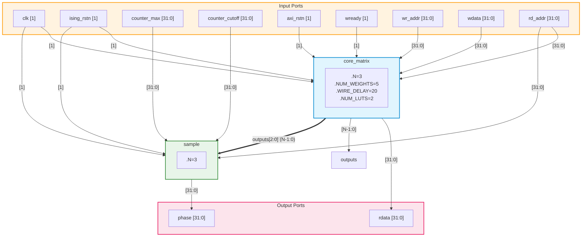
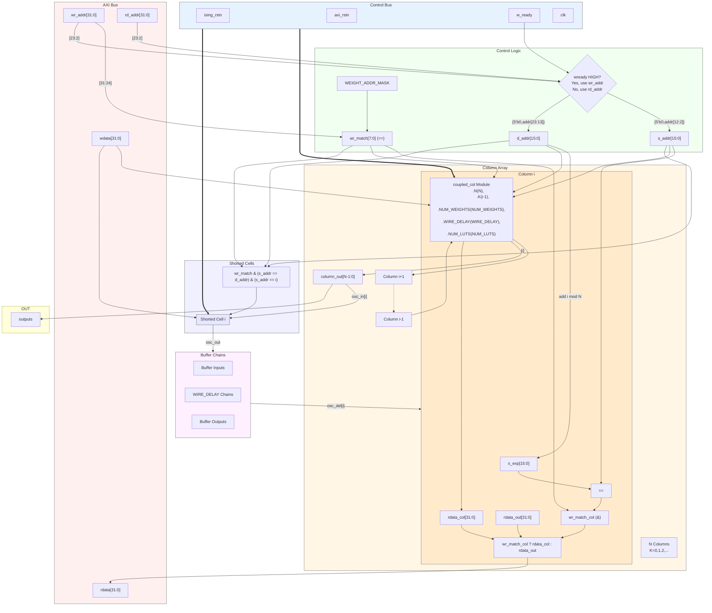
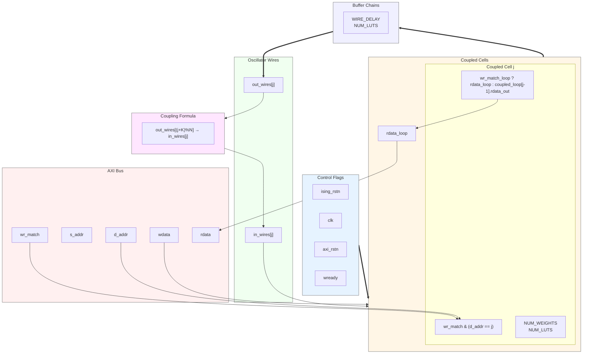
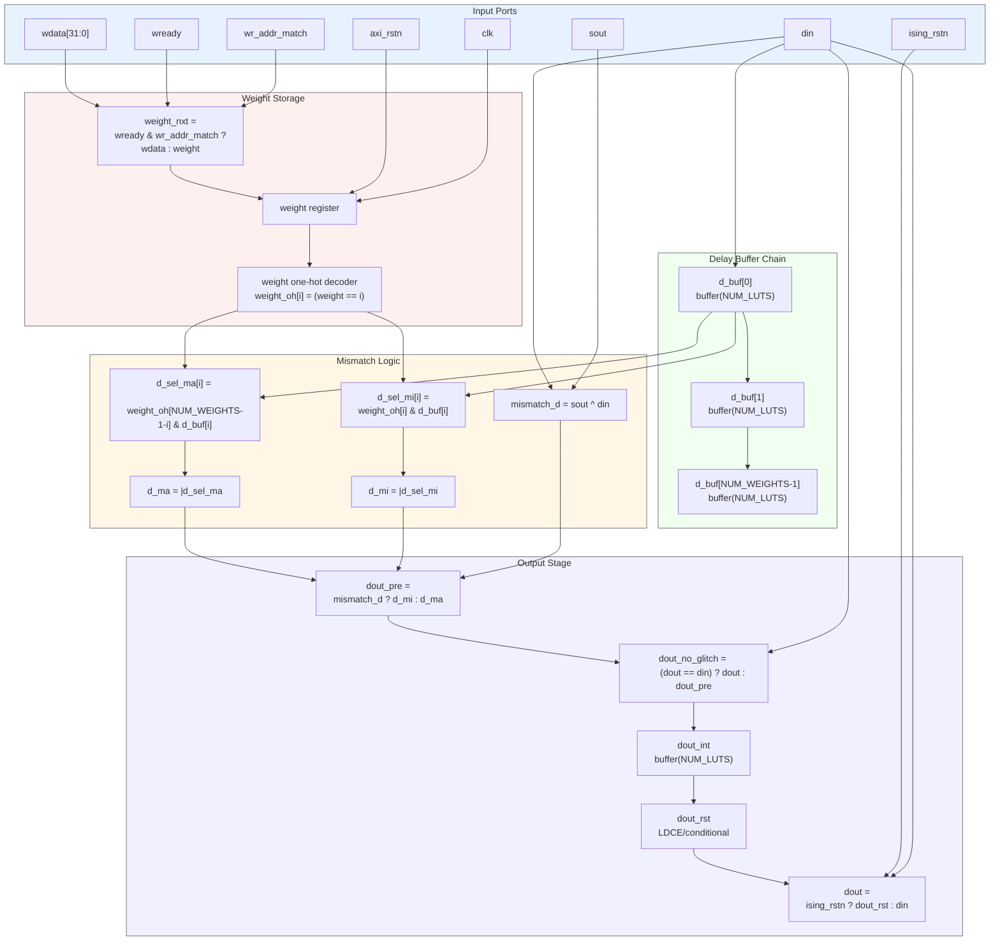
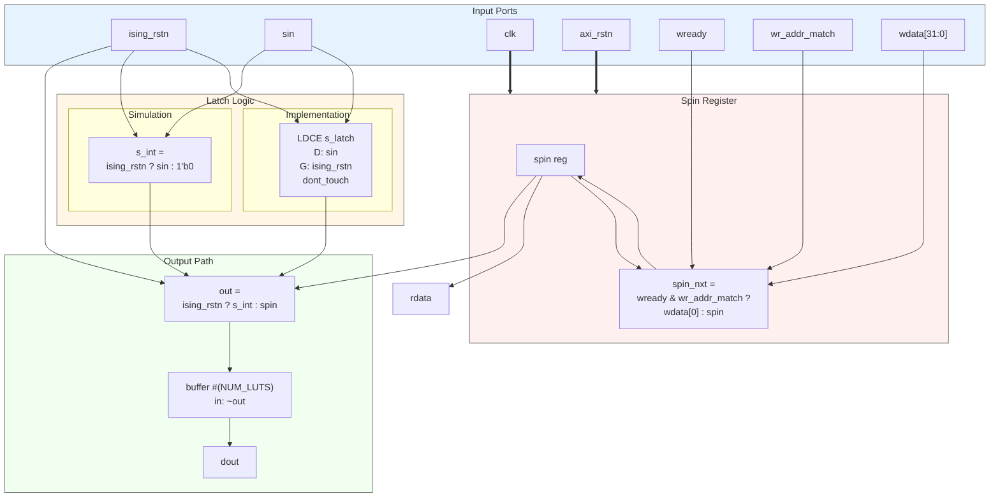
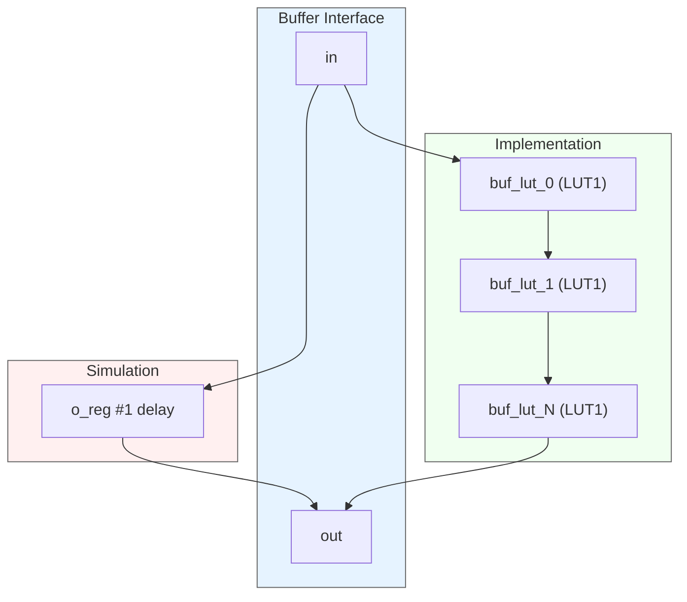
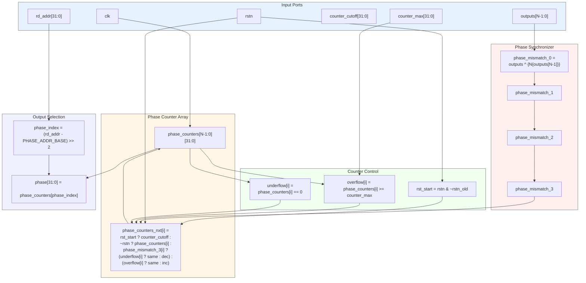
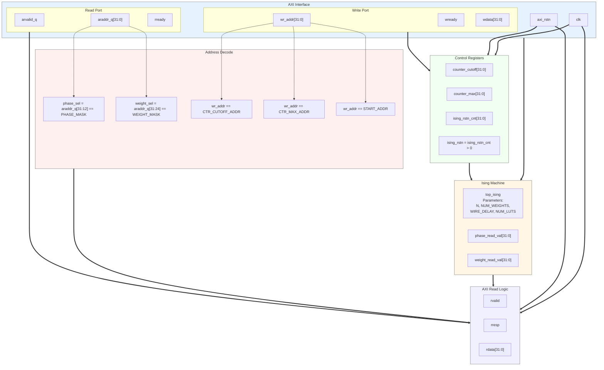

# DIMPLE Technical Report

DIMPLE (Digital Ising Machines from Programmable Logic, Easily!) is an attempt to create an entirely digital coupled Ising machine. Instead of using voltage-based coupling, this project leverages a phase-based coupling method where different oscillators control configurable delay cells in each others' oscillation path. The aim of the project is to create Ising machine that can be deployed on an FPGA allowing for technological ubiquity, and ultimately manufactured in an advanced process node.

## Top-Level Digital Ising Machine

The following diagram shows the top-level architecture of the computational core of DIMPLE (Digital Ising Machines from Programmable Logic, Easily) implementation without its AXI interface. This design implements a coupled-oscillator system on FPGA to solve optimization problems like Maximum Cut. This implementation achieves microsecond-scale convergence for optimization problems, while being fully digital and deployable on commercial FPGAs like AWS F1 instances.



### Architecture Details
The diagram shows the two main components of DIMPLE:

#### `core_matrix`
Implements an array of coupled ring oscillators, in this case it contains N=3 oscillators in this example (can scale up to 128 in full implementation) and uses digital "resistors" made from LUTs for coupling between oscillators `WIRE_DELAY` and `NUM_LUTS` define the underlying oscillator coupling circuitry which are then programmed using the `wdata` and `wr_data` registers and `w_ready` flag via the AXI interface. `clk`, `axi_rstn` and `ising_rstn` are used to control logic in the `coupled_cells` and `shorted_cells` which the individual oscillators are composed of. All status/control data is then routed to 32-bit address `rd_addr` via the `rdata` line via the AXI interface, where as oscillator data is fed to the `sample` module via the `output[N-1:0]` wire.

#### `sample`
 Compares oscillator phases fed to it on the `output[N-1:0]` wire to determine spin states (+1 or -1) and uses `counter_max`/`counter_cutoff` to determine sampling window. The design outputs final phase measurements through `phase` port. The AXI interface (`wready`, `wr_addr`, `wdata`, `rd_addr`, `rdata`) allows programming of coupling weights between oscillators, effectively defining the optimization problem to be solved.

## Core Matrix

The core computational element of DIMPLE is the `core_matrix` module, which implements an NxN array of coupled ring oscillators. This module creates the physical substrate for solving Ising model problems through oscillator phase relationships. The architecture enables all-to-all coupling between N spins through a digital implementation.

### Structural Overview

The following diagram details the structural implementation of core_matrix, showing the primary data paths and control interfaces:



### Implementation Details
The core_matrix module is parameterized by four key values:

`N`: Number of oscillators/spins in the system
`NUM_WEIGHTS`: Weight resolution for coupling strengths
`WIRE_DELAY`: Number of delay stages in feedback path
`NUM_LUTS`: Number of LUTs per delay element

The architecture consists of five main functional blocks:

**Address Decoder**: Processes AXI memory-mapped interface addresses, splitting them into source (`s_addr`) and destination (`d_addr`) fields for weight configuration. The upper address bits are validated against `WEIGHT_ADDR_MASK` to ensure proper addressing.
**Column Array**: Implements `N` columns of coupled cells, where each column `k` introduces couplings with distance `k`. Column `0` serves as the input stage, while columns `1` through `N-1` contain programmable coupling cells that implement the Ising interaction weights.
**Shorted Cells**: Provides initialization and measurement points for each ring oscillator. These cells can be programmed through the AXI interface to set initial oscillator states and read current states.
**Delay Buffer Arrays**: Creates the primary oscillator feedback path using cascaded LUT-based buffers. The `WIRE_DELAY` parameter controls the oscillation frequency by setting the total path delay.
**Feedback Path**: Connects the delay buffer outputs back to Column 0, completing N independent ring oscillator loops that can influence each other through the coupling columns.

All synchronous interfaces (AXI) are clocked by the system clock, while the oscillator array operates asynchronously to maximize operating frequency. The outputs bus provides direct access to oscillator states for phase measurement and analysis.


## Coupled Column (`coupled_col`)
The coupled column implements N oscillator couplings with a fixed distance pattern K. For each input i, it creates 
a coupling to position (i+K+1)%N, forming an asymmetric coupling pattern around the ring.



### Key Parameters
- `N`: Number of oscillators (typically 3-64)
- `K`: Coupling distance (0 to N-1)
- `NUM_WEIGHTS`: Resolution of coupling strength
- `WIRE_DELAY`: Stabilizing delay length
- `NUM_LUTS`: LUTs per delay element

### Architecture
1. **Coupling Array**: N coupled_cells arranged to implement K+1 coupling pattern:
    - Input i couples to output (i+K+1)%N
    - Each cell has independent weight configuration
    - Forms asymmetric coupling matrix

2. **Delay Stabilization**: Each output passes through `WIRE_DELAY` buffers:
  ```verilog
  wire [WIRE_DELAY-1:0] out_del;
  buffer #(NUM_LUTS) buf0(.in(out_wires_pre[j]), .out(out_del[0]));
  ```

3. **Configuration**: AXI interface for weight programming:
    - `wr_match` selects column
    - `d_addr` selects specific cell
    - `wdata` sets coupling weight

### Coupled Cell (coupled_cell)
Each coupled cell implements a programmable delay element that modifies signal timing based on phase relationships.
Key Parameters

`NUM_WEIGHTS`: Number of possible delay values (coupling strengths)
`NUM_LUTS`: LUTs per basic delay element



#### Weight Configuration
```verilog
reg  [$clog2(NUM_WEIGHTS)-1:0] weight;
wire [NUM_WEIGHTS-1:0] weight_oh;
```

Stores coupling strength in weight register (0 to `NUM_WEIGHTS-1`) and then converts it to a one-hot encoding for delay selection. Configurable through AXI interface (`wready`/`wr_addr_match`/`wdata`) but defaults to middle weight on reset (`NUM_WEIGHTS/2`).

#### Phase-Based Delay Selection

Note that the `din` and `sout` lines are the `in_wires` and `out_wires` seen in the `coupled_col` diagram above.

```verilog
assign mismatch_d = sout ^ din;
wire [NUM_WEIGHTS-1:0] d_buf;  // Delay buffer chain
```

The cell implements asymmetric coupling through two key mechanisms:

**For In-Phase Oscillators** (`mismatch_d = 0`):

Uses `d_sel_ma` (match) delays where, stronger weights = longer delays = weaker coupling, this is implemented by indexing from end of `weight_oh: weight_oh[NUM_WEIGHTS-1-i]`.

**For Out-of-Phase Oscillators** (`mismatch_d = 1`):

Uses `d_sel_mi` (mismatch) delays where stronger weights = shorter delays = stronger coupling, this is implemented by direct indexing: `weight_oh[i]`


#### Delay Implementation
```verilog
generate for (i = 1; i < NUM_WEIGHTS; i = i + 1) begin
    buffer #(NUM_LUTS) bufid(.in(d_buf[i-1]), .out(d_buf[i]));
end endgenerate
```

Chain of `NUM_WEIGHTS` delay elements where each element uses `NUM_LUTS` Look-Up Tables (LUTs) which are configured as inverters (`INIT=2'b10`), `dont_touch` prevents optimization.

#### Glitch Prevention
```verilog
assign dout_no_glitch = (dout == din) ? dout : dout_pre;
LDCE d_latch (.Q(dout_rst), .D(dout_int), .G(ising_rstn));
```

Three layers of stability protection:

1. Glitch suppression logic prevents spurious transitions
2. Feedback stabilization buffer
3. Transparent latch masks combinational loops from tools

#### Physical Operation
The cell modifies oscillator coupling strength by adjusting signal propagation delays:

**Strong Positive Coupling**:

- Short delay when oscillators mismatched
- Long delay when matched
- Brings oscillators into phase


**Strong Negative Coupling**:

- Long delay when oscillators mismatched
- Short delay when matched
- Pushes oscillators out of phase


**Zero Coupling** (`weight = NUM_WEIGHTS/2`):

- Equal delays for match/mismatch
- No phase influence

All delays are implemented through cascaded LUTs to ensure predictable timing characteristics across FPGA implementations. This creates controlled, predictable delay chains that implement the coupling interaction between oscillators.

### Shorted Cell



The `shorted_cell` module initializes and maintains spin states. It acts as an initialization point for each oscillator in the system, allowing programmatic control over the spin's starting state (+1 or -1) while maintaining proper oscillation during normal operation.

### Key Functions

#### 1. Spin State Management
- Stores and maintains a programmable spin state in a register
- Allows AXI bus writes to modify the spin value through `wdata[0]`
- State is readable through the `rdata` output for monitoring

#### 2. Oscillator Phase Control
The module serves two distinct operational modes:

##### Initialization Mode (`ising_rstn` low)
- Forces the output `dout` to match the programmed spin state
- Effectively initializes the oscillator to a known +1 or -1 state

##### Running Mode (`ising_rstn` high)
- Allows normal oscillation by passing through the input signal `sin`
- Uses either simulation logic or an LDCE (transparent latch) to prevent combinational loops
- Inverts the output through a buffer chain to maintain oscillation

#### 3. Delay Management
- Implements configurable delay through `NUM_LUTS` parameter
- Uses buffer chains to ensure proper oscillator timing
- Helps maintain stable oscillation frequency

### Context in DIMPLE Architecture
The shorted cell is used to:
1. Initialize the Ising machine spins to specific states before solving
2. Maintain stable oscillation during problem-solving
3. Provide clean phase transitions between initialization and running modes
4. Enable readback of spin states through the AXI interface

The module's combination of programmable initialization and controlled oscillation makes it essential for setting up and solving Ising optimization problems in DIMPLE's FPGA implementation.

### Implementation Notes
- Uses transparent latches (`LDCE`) in hardware to trick synthesis tools about combinational loops
- Implements different behavior for simulation vs hardware through `ifdef` directives
- Part of DIMPLE's all-digital approach to oscillator-based computing

## Buffer



## Phase Sampling and Measurement Block

### Sample Module Overview
The sample module performs phase measurement across N oscillators, using synchronization and counter-based techniques to determine the relative phases of the oscillators in the system.

#### Key Parameters
- `N`: Number of oscillators to sample (typically matches `core_matrix` N)
- `counter_max`: Maximum value for phase counters
- `counter_cutoff`: Initial/reset value for counters

### Architecture



1. **Phase Mismatch Detection**
  - Compares each oscillator phase with reference (last oscillator)
  - Uses XOR operation for phase comparison:
  ```verilog
  assign phase_mismatch_0 = outputs ^ {N{outputs[N-1]}};
  ```

2. **Synchronization Chain**

- 4-stage synchronizer prevents metastability
- Samples asynchronous oscillator outputs into clock domain

```verilog
always @(posedge clk) begin
    phase_mismatch_1 <= phase_mismatch_0;
    phase_mismatch_2 <= phase_mismatch_1;
    phase_mismatch_3 <= phase_mismatch_2;
end
```

3. **Phase Counter Array**

- N 32-bit counters track relative phase relationships
- Increment/decrement based on synchronized phase mismatch
- Bounded by counter_max and zero
- Reset to `counter_cutoff` value on rstn rising edge

4. **Counter Update Logic**

```verilog
assign phase_counters_nxt[i] = 
    rst_start           ? counter_cutoff         :  
    ~rstn              ? phase_counters[i]      :	
    phase_mismatch_3[i] ? (
        underflow[i]   ? phase_counters[i]      :
                        phase_counters[i] - 1 ) :
    (overflow[i]       ? phase_counters[i]      :
                        phase_counters[i] + 1 );
```

#### Output Interface

Phase values readable through memory-mapped interface `rd_addr` selects which oscillator's phase to read. Phase value represents accumulated count of phase relationship.

## AXI Interface and Control Registers

The `ising_axi` module provides an AXI-lite compatible interface for controlling and monitoring the DIMPLE Ising machine.



### Memory Map

#### Control Registers

1. **Counter Cutoff** (`CTR_CUTOFF_ADDR`)
- Initial/reset value for phase counters
- Write-only Register

2. **Counter Max** (`CTR_MAX_ADDR`)
  - Maximum value for phase counters
  - Write-only register

3. **Reset Control** (`START_ADDR`)
  - Controls ising_rstn signal
  - Write triggers countdown timer
  - Active high during countdown

#### Read Address Space
- **Phase Values** (`PHASE_ADDR_MASK`)
 - Upper bits [31:12] select phase reading
 - Returns current phase counter values

- **Weight Values** (`WEIGHT_ADDR_MASK`)
 - Upper bits [31:24] select weight reading
 - Returns coupling weights

### AXI Protocol Implementation

#### Read Channel
```verilog
always @(posedge clk) begin
   if (arvalid_q) begin
       rvalid <= 1;
       rdata  <= phase_sel  ? phase_read_val  : 
                 weight_sel ? weight_read_val :
                             32'hAAAAAAAA    ;
       rresp  <= 0;
   end
end
```

#### Write Channel

- Direct writes to control registers
- Address-decoded writes to coupling weights
- Reset control with countdown:

```verilog
wire ising_rstn = (ising_rstn_cnt > 0);
```

#### Interface Features

- AXI-lite compatible read/write
- Address-based multiplexing of data sources
- Automatic reset countdown timer
- Default values (0xAAAAAAAA) for unmapped addresses